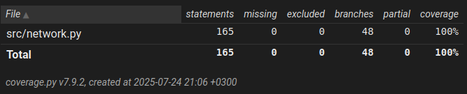
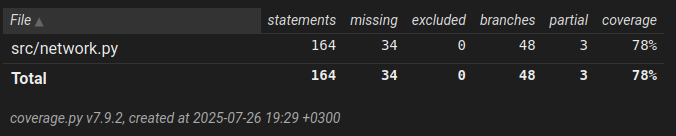

## Testausdokumentti

### Yksikkötestit

Testataan, että neuroverkko muodostuu oikein, niin että
* painot ja vakiotermit ovat oikeantyyppisiä
* paino- ja vakiotermimatriisit ovat oikeanmuotoisia
* verkon tulosteet ovat oikeantyyppisiä
* verkon tulosteet ovat oikeanmuotoisia

Testataan, että gradientti lasketaan oikein, niin että
* delta-arvot ovat oikeanmuotoisia
* gradientti vastaa muodoltaan painoja ja vakiotermejä
* kaikki gradienttimenetelmät pienentävät tappiofunktion arvoa pienellä tietokannalla, joka mallintaa XOR-portin toimintaa

Testataan, että verkon tallentaminen ja lataaminen toimii vertaamalla tallennettua ja ladattua verkkoa toisiinsa.

Testataan, että neuroverkon laskema tappio suppealla datalla on järkevissä rajoissa (0 - n ^ 2).

Seuraavissa testeissä käytetään sataa MNIST-tietokannan kuvaa ykkösistä ja kakkosista.

Testataan, että neuroverkon laskema tarkkuus on järkevissä rajoissa (0 - 1).

Testataan, että kaikki gradienttimenetelmät ylisovittuvat dataan luokittelutarkkuudella 1.

Testataan, että neuroverkon testiluokittelu palauttaa järkevät listat.

### Invarianttitestit

Testit kattavat kaikki neuroverkon gradienttimenetelmään liittyvät metodit, lukuunottamatta vahvistusdatan käsittelyä, jolla ei ole neuroverkon parametrien kannalta merkitystä.

Testataan, että erikokoisilla neuroverkoilla kaikki painot ja vakiotermit muuttuvat kaikkien gradienttimenetelmien aikana.
* Verkot ovat kooltaan välillä pienin mahdollinen - suurin mahdollinen, joka voidaan luoda käyttöliittymässä.
* Testidatana sata MNIST-tietokannan kuvaa ykkösistä ja kakkosista.
